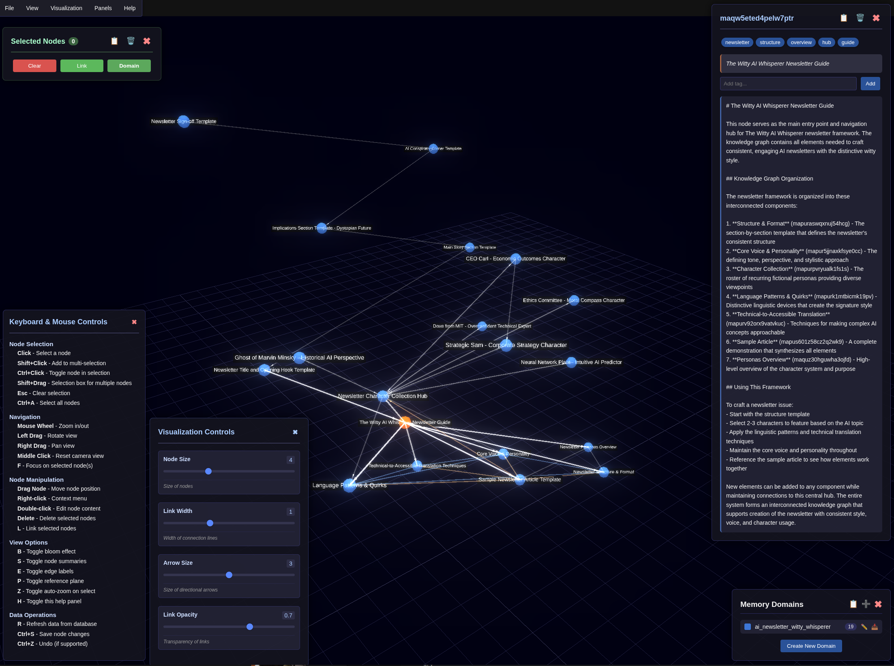

# Memory Graph Interface

A 3D visualization interface for exploring and interacting with memory graphs created by the [memory-graph MCP](https://github.com/aaronsb/memory-graph).



## Overview

Memory Graph Interface is a companion application to the [memory-graph MCP](https://github.com/aaronsb/memory-graph) which creates and manages memory nodes. This interface provides a powerful 3D visualization of memory nodes and their relationships, allowing for intuitive exploration and manipulation of the memory graph.

## Demo

Watch the Memory Graph Interface in action:

[](https://www.youtube.com/watch?v=u9EFn4BcviY)

Click the image above to watch a demonstration of the Memory Graph Interface being used in real time.

## Features

- **3D Force-Directed Graph**: Visualize memory nodes and their connections in an interactive 3D space
- **Node Interaction**: Click nodes to view detailed content, add tags, and manage connections
- **Link Creation**: Create links between nodes by shift-clicking or dragging nodes together
- **Visual Cues**: Node sizes reflect the number of tags (larger nodes have more tags), and colors indicate domain membership
- **Real-time Updates**: Automatically detect changes to the underlying database
- **Visual Effects**: Toggle bloom effect for enhanced visualization
- **Multi-domain Support**: Visualize connections across different memory domains
- **Export/Import Domains**: Export individual memory domains as JSON files and import them to other databases
  - Export entire domains with nodes, edges, and tags
  - Import domains with collision handling - existing nodes get updated
  - Cross-domain edges excluded from exports to maintain domain independence

## Getting Started

### Prerequisites

- Node.js (v16 or later)
- NPM (v8 or later)
- A compatible SQLite database created by the memory-graph MCP

### Database Requirements

This application requires a SQLite database with a specific schema that matches the memory-graph MCP. Please see [database-schema.md](docs/database-schema.md) for schema details.

A test database is included in the root directory for demo purposes.

### Quick Start (Recommended)

We provide a setup script that handles all installation steps automatically:

1. Clone the repository:
   ```
   git clone https://github.com/aaronsb/memory-graph-interface.git
   cd memory-graph-interface
   ```

2. Run the setup script:
   ```
   ./setup.sh
   ```

   This script will:
   - Check system prerequisites
   - Install dependencies
   - Create a .env file if needed
   - Detect and configure an available database
   - Build the JavaScript bundle
   - Provide helpful startup instructions

3. Start the application:
   ```
   npm start
   ```

4. Open your browser and navigate to `http://localhost:3000`

### Manual Installation

If you prefer to set up manually:

1. Clone the repository:
   ```
   git clone https://github.com/aaronsb/memory-graph-interface.git
   cd memory-graph-interface
   ```

2. Install dependencies:
   ```
   npm install
   ```

3. Build the JavaScript bundle:
   ```
   npm run build:js
   ```

4. Configure the database path in a `.env` file (you can copy from the example file):
   ```
   cp .env.example .env
   ```
   
   Then edit the `.env` file to set your database path:
   ```
   PORT=3000
   DB_PATH=/path/to/your/memory-graph.db
   ```

   You can use the test database included in the project by setting:
   ```
   DB_PATH=./memory-graph.db
   ```

5. Start the application:
   ```
   npm start
   ```

6. Open your browser and navigate to `http://localhost:3000`

### Development Mode

For development with auto-reloading:

```
npm run dev
```

This will build the JavaScript bundle, start the server, and watch for changes to rebuild automatically.

### Using Docker

To run the application using Docker:

1. Build the Docker image:
   ```
   npm run docker:build
   ```

2. Start the container:
   ```
   npm run docker:start
   ```

3. View logs from the running container:
   ```
   npm run docker:logs
   ```

4. Stop the container:
   ```
   npm run docker:stop
   ```

By default, Docker will look for a database at `/home/aaron/Documents/memory-graph-mcp/memory-graph.db`. You can modify this path in the `docker-compose.yml` file.

## Available Scripts

We've organized the npm scripts into logical categories:

### Development
- `npm run dev` - Start development mode with auto-reloading
- `npm run watch` - Run webpack in watch mode
- `npm run server` - Start only the Express server

### Production
- `npm start` - Build JS and start the server
- `npm run build` - Build JS in production mode

### Docker
- `npm run docker:build` - Build the Docker image
- `npm run docker:start` - Start the Docker container
- `npm run docker:stop` - Stop the Docker container
- `npm run docker:logs` - View container logs

For more details on contributing to this project, see [CONTRIBUTING.md](CONTRIBUTING.md).

## Usage

- **View Node Details**: Click on a node to see its content and tags
- **Create Links**: Shift-click two nodes to create a link between them
- **Drag to Link**: Drag a node near another to automatically create a link
- **Delete Links**: Control-click on a link to delete it
- **Delete Nodes**: Control-click on a node to delete it and all its connections
- **Add Tags**: Select a node and use the tag input field to add new tags
- **Refresh Data**: Click the "Refresh Data" button to manually update the visualization
- **Toggle Effects**: Use the "Toggle Bloom" button to enable/disable the bloom visual effect
- **Select Database**: In the File menu, select "Open Database" to choose a different database file using the file browser
- **Export Domain**: 
  - From the File menu, select "Export Domain..."
  - Choose a domain from the dropdown list
  - Click Export to download the domain as a JSON file
  - Alternatively, click the 📥 icon next to any domain in the Memory Domains panel
- **Import Domain**:
  - From the File menu, select "Import Domain..."
  - Choose a JSON file exported from Memory Graph
  - Review the import preview showing nodes and edges
  - Click Import to add the domain to your current database
  - Existing nodes will be updated, new nodes will be created

## Multi-Agent Support

The Memory Graph Interface can be used by multiple agents simultaneously, all accessing the same memory database. This allows for collaborative memory management and exploration across different AI systems.

## Database Selection

The application provides a file browser interface for selecting SQLite database files:

1. Click **File** in the menu bar, then select **Open Database**
2. You can either:
   - Type a full path manually in the input field
   - Use the **Browse** button to open the file browser
   - Select from previously used database paths using the dropdown

Using the file browser:
- Navigate through directories by clicking on folder names
- Filter files to only show `.db` SQLite database files
- Click once on a file to select it
- Double-click a file to select and confirm it immediately
- Use the **Parent Directory** button to go up a level
- Use the **Refresh** button to reload the current directory

After selecting a database, click **Confirm** to load it into the application.

## Troubleshooting

- **Database Errors**: If you see errors like "no such table: MEMORY_NODES", ensure your database has the correct schema. See [database-schema.md](docs/database-schema.md) for details.
- **JavaScript Not Loading**: If the visualization doesn't appear, make sure you've built the JavaScript bundle with `npm run build:js`.
- **Docker Issues**: If using Docker, ensure the volume path in `docker-compose.yml` points to a valid directory with your database file.
- **File Browser Not Working**: If the file browser doesn't load directories correctly, check server permissions on the directories you're trying to access.

## Related Projects

- [memory-graph MCP](https://github.com/aaronsb/memory-graph): The MCP server that creates and manages the memory nodes visualized by this interface

## License

[MIT License](LICENSE)
